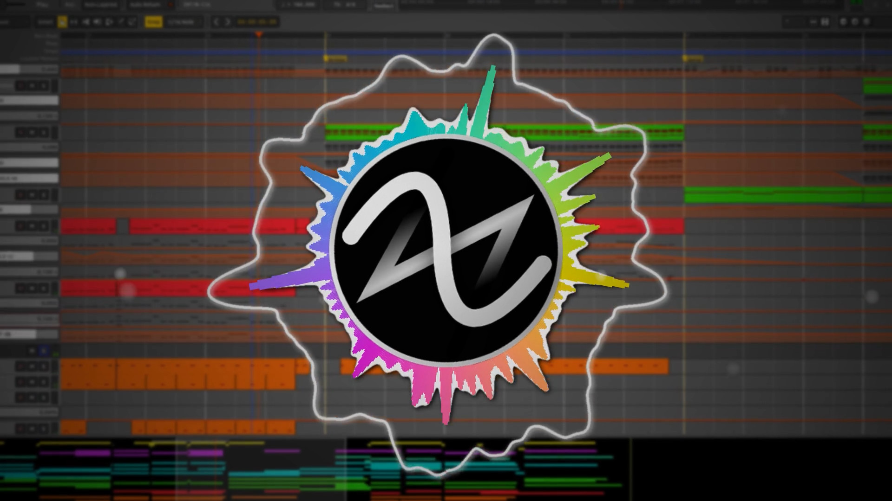
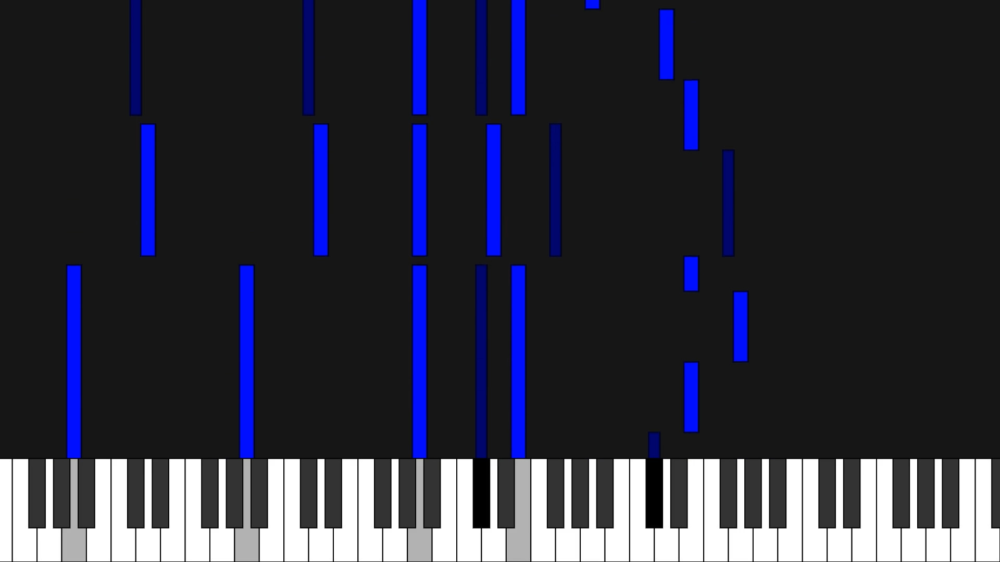

# Modular Music Visualizer

An attempt to make a free (as in freedom) and open source music visualization (After Effects and Synthesia)-like tool for the music production community.

#### Audio + MMV configuration script = Final video

#### Audio + MIDI file = Piano Roll video tutorial

I gently ask you to read about the [Free Software Definition / Philosophy](https://www.gnu.org/philosophy/free-sw.html) and join us!! :)

This project wasn't extensively tested on Windows, feedback appreciated.

## Small showcase



This screenshot is from a track of mine I released using MMV!!

_The DAW is Ardour 6.0_

[Link on YouTube](https://www.youtube.com/watch?v=KRI9cKPsK1Q)



You can generate this piano roll by running `example_piano_roll.py` :)

*Bonus!!*

[Unlisted video of old version of MMV](https://youtu.be/BhpLwaR1Oj8)

# Reorganization of MMV's core core structure on develop branch!!

# Idea

So I am a Free and Open Source music producer hobbyist that also happens to be a code hobbyist and at some point it's inevitable I'd be releasing my tracks to the internet and create some project to make the world a better place.

The problem is, I don't want to release a video of the track on a platform with a static image or just recording the screen nor pay for some software to generate an "music visualization" for me without much control of it.

So I searched up for a free (as in freedom and price) tool that does exactly that, they do exist but aren't as good as they could be, most of the time a bit basic..

Then I just got into this opportunity on making a suckless (as in quality not minimalism I see you lol) music visualization tool with the programming languages and tools I love and care.

# Table of contents

   * [Running](#running)
      * [Linux](#linux)
      * [Windows](#windows)
   * [Goals, what is being developed](#goals-what-is-being-developed)
   * [Contributing](#contributing)


# Wiki is TODO

Lot's of stuff are moving on the code and being rewritten, when things are more stable I'll write a proper guide.

Use the example scripts located on the project root folder as for now for learning and / or read the code, it's pretty well commented

You can open issues or DM me asking how the code works, where to start contributing, what is needed, anything.

# Running

## IMPORTANT!!

### YOU MUST USE A 64 BIT PYTHON INSTALLATION

`skia-python` package only includes 64 bit wheels on PyPI as Skia 32 bits is not available for the public.

### General recomendations

If you're going to venture out on creating your own MMV scripts or hacking the code, making new presets, I highly recommend reading the basics of Python [here](https://learnxinyminutes.com/docs/python/), it doesn't take much to read and will avoid some beginner pitfals.

Though you probably should be fine by just creating a copy of the example scripting I provide on the repo and reading through my comments and seeing the Python code working, it's pretty straightforward the top most abstracted methods as I tried to simplify the syntax and naming functions with a more _"concrete"_ meaning. 

## Linux / Windows

I will be referring to where the source code folder of MVM is located at using the keyord `ROOT`, like the `LICENSE.md` file under `ROOT/LICENSE.md`.

Note: on Windows you might need to replace `python` with `python.exe` if using PowerShell (recommended) or CMD (I'm not completely sure btw) 

Another point is that directories on Windows uses `\` instead of (what everything else uses) `/`, Python should convert those automatically but maybe not within the shell, like: `.\path\to\executable.exe` instead of `./path/to/executable.exe`, the second one might not run. This does not apply on the Python scripts as it'll auto convert `/` to `\\`.

### Install Python 64 bits (REQUIRED) and FFmpeg

#### Linux:

- Arch Linux / pacman based (Manjaro): `sudo pacman -Syu python ffmpeg`

- Ubuntu / apt based: `sudo apt update && sudo apt install python3 python3-venv python3-dev python3-setuptools ffmpeg`

#### Windows:

Head over to [Python Releases for Windows](https://www.python.org/downloads/windows/), download a _"Windows x86-64 executable installer"_ (I currently use Python 3.8), install it (be sure to check _"ADD PYTHON TO PATH"_ option on the installer)

Download a compiled FFmpeg [build](https://ffmpeg.zeranoe.com/builds/), the binary must be available within PATH environment for `ffmpeg-python` package to use.

Either add to PATH environment var a folder with `ffmpeg.exe` binary if you know or drop FFmpeg's binary into the same directory as the `example_*.py`.

### Installing Pillow-SIMD for faster performance

While this package is not required and you can keep the default Pillow package, using [pillow-simd](https://github.com/uploadcare/pillow-simd) instead of the vanilla package, as you can see [here](https://python-pillow.org/pillow-perf/), is indeed faster, however Pillow isn't the biggest bottleneck in the code, so you'd get performances (guessing) at most 10% faster.

Install the listed [prerequisites](https://pillow.readthedocs.io/en/stable/installation.html#building-from-source) according to your platform on their documentation, and as mentioned on the main repo README, install `pillow-simd` with:

```bash
$ pip uninstall pillow
$ pip install pillow-simd
```

If you want you can use AVX2 enabled build installation with:

```bash
$ pip uninstall pillow
$ CC="cc -mavx2" pip install -U --force-reinstall pillow-simd
```

You can safely skip this section and use regular Pillow, but with longer render times this few performance gains can stack a lot.

### Getting the source code

#### Using git CLI

Install git from your Linux distro or for Windows the installer from [git downloads page](https://git-scm.com/downloads)

Open a shell on desired dir to clone the repo (GIT shell on Windows)

`git clone https://github.com/Tremeschin/modular-music-visualizer`

#### GitHub repository main page

You might be already here, head to the top page and there is a green button _"⬇️ Code"_ and download as a ZIP.

Use a archive manager (something like 7-zip or rar) to extract the contents into a folder you'll be running MMV.

## Open a shell on MMV source code folder

I recommend PowerShell on Windows or your preferred terminal emulator on Linux using bash

## Installing Python dependencies

It is not a bad idea to install MMV dependencies on a separate virtual environment of Python packages to keep things isolated.

[Quick guide on using / creating Python venvs](https://github.com/Tremeschin/dandere2x-tremx/wiki/Python-venvs), TL;DR:

- `python -m venv mmv-venv`

- Linux: `source ./mmv-venv/bin/activate`

- Windows (not sure): `.\venv-path\Scripts\activate.bat`

After that you can point Python's package installer (pip) the file located at `ROOT/mmv/mmv/requirements.txt`

`pip install -r ./mmv/mmv/requirements.txt`, assuming your shell is under `ROOT` directory.

You can run a example file under `ROOT/mmv/example*.py` with `python ROOT/mmv/example*.py`

I include a few free assets under the `mmv/assets/free_assets` folder, you can use them at your disposal, they were generated with my other project called [PyGradienter](https://github.com/Tremeschin/pygradienter) that I'm merging the two here in MMV :)

There's also the example of calling pygradienter from a MMV script and a WIP Piano Roll.

# Goals, what is being developed

#### High priority / now

I might attempt to rewrite this project in the future as things currently are becoming a bit convolutet, though not spaghetti code yet.

- [ ] Implement MIDI visualization (that'd be fun)

- [x] *CAN BE EXPANDED* (30%) Progression bar (square, circle, pie graph?)

- [ ] Implement text support

- [ ] ..lyrics also?

- [ ] Comment new code after this huge R&D, simplifications

- [x] (basically 90% done) Huge refactor of the code and moving a lot of stuff, simplifying interpolation and making Modifier classes individually

- [x] ~~(stuck) R&D alternative methods for converting SVG --> PNG under Python because Windows (or could someone write a small guide for installing cairo under Windows that works? I didn't put much effort until now on this)~~ `skia-python` solved all this

- [x] ~~(half worked) R&D alternative methods for rendering the final frame (each branch is one way I tried _- and failed or wasn't really efficient_)~~ `skia-python` seems VERY promising, `pyvips` almost worked but skia was faster

#### Medium priority

- [x] ~~Profile the code, find bottlenecks, general optimization on most expensive functions~~ Video background is a bottleneck now because moving textures back and forth from the GPU, other than that the code is running fast

- [x] ~~(boring) Update requirements.txt~~

- [x] ~~Make a proper presentation / demo / gif about MMV and link on README~~ didn't work well

#### Ideas for the future or waiting to be executed

- [ ] Rectangle bars visualizer (only circle + linear or symetric currently)

- [ ] Rain images on pygradienter and rain particle generator?

# Contributing

Please read [CONTRIBUTING.md](docs/CONTRIBUTING.md) file :)
